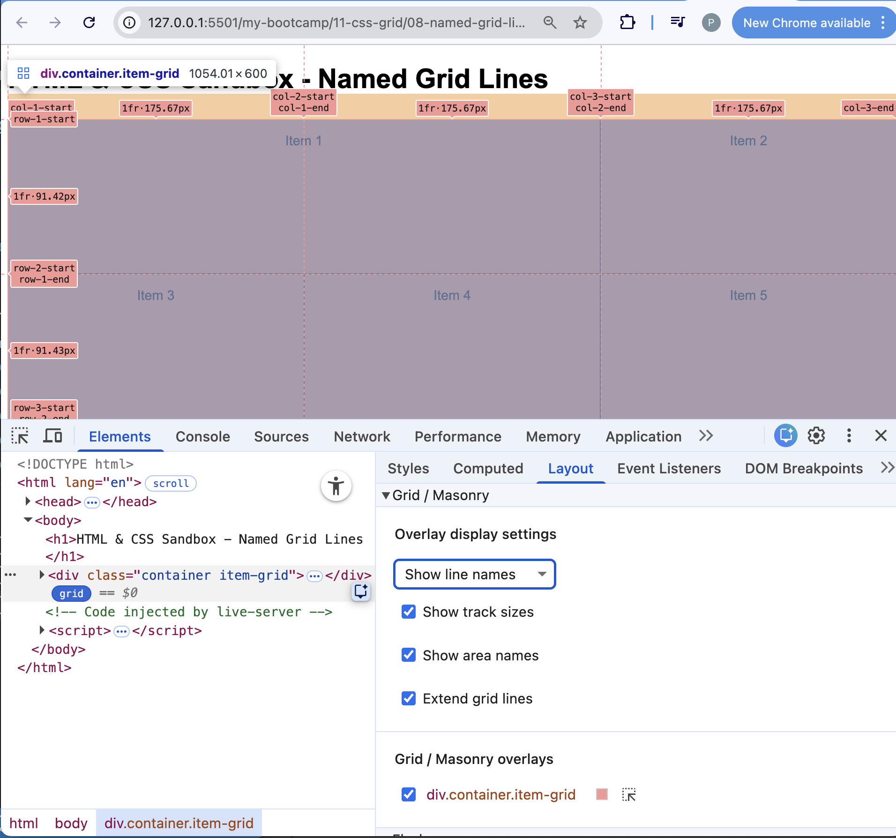

# CSS Grid 
- CSS Grid allows precise layout of multiple columns and rows
- Grid is best used for overall page layout and navigation, while Flexbox is better for smaller components
- Grids are made up of grid containers and grid items
- To create a grid, set the display property of a container to `grid` or `inline-grid`
- Define rows and columns using `grid-template-rows` and `grid-template-columns` (you do have to define items, unlike Flexbox)
- Use `grid-gap` to set spacing between rows and columns
- Place items using properties like `grid-column`, `grid-row`, `grid-area`, or shorthand `grid`
- CSS Grid supports named grid areas for easier placement of items
- Media queries can be used to create responsive grid layouts

NOTE: 
- Chrome DevTools has a Grid Inspector to help visualize grid layouts
- Click the grid icon in the Elements panel to see the grid overlay and details:

## References:
- https://www.udemy.com/course/modern-html-css-from-the-beginning/learn/lecture/13285632#overview
- https://www.udemy.com/course/modern-html-css-from-the-beginning/learn/lecture/13285636#overview
- https://developer.mozilla.org/en-US/docs/Web/CSS/Guides/Grid_layout
- https://css-tricks.com/snippets/css/complete-guide-grid/

